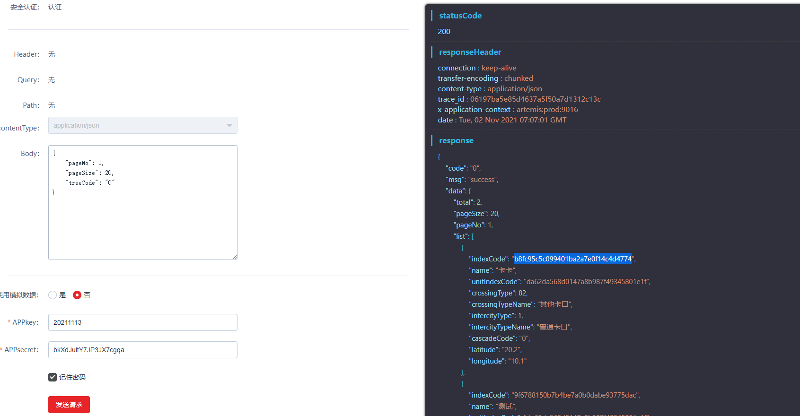
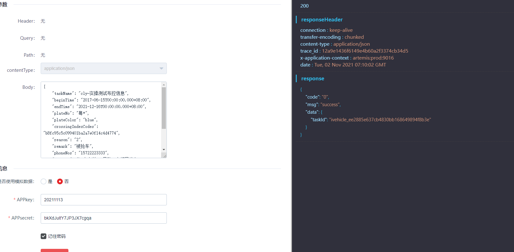
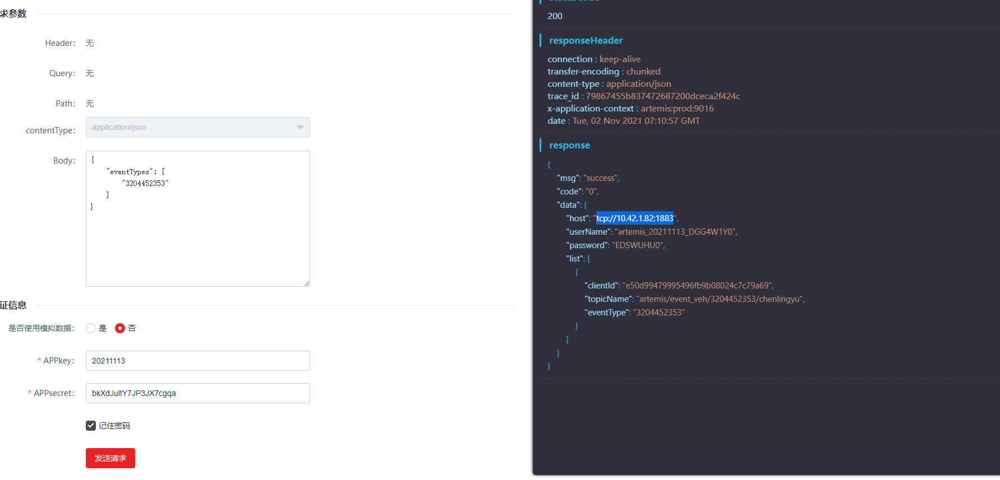
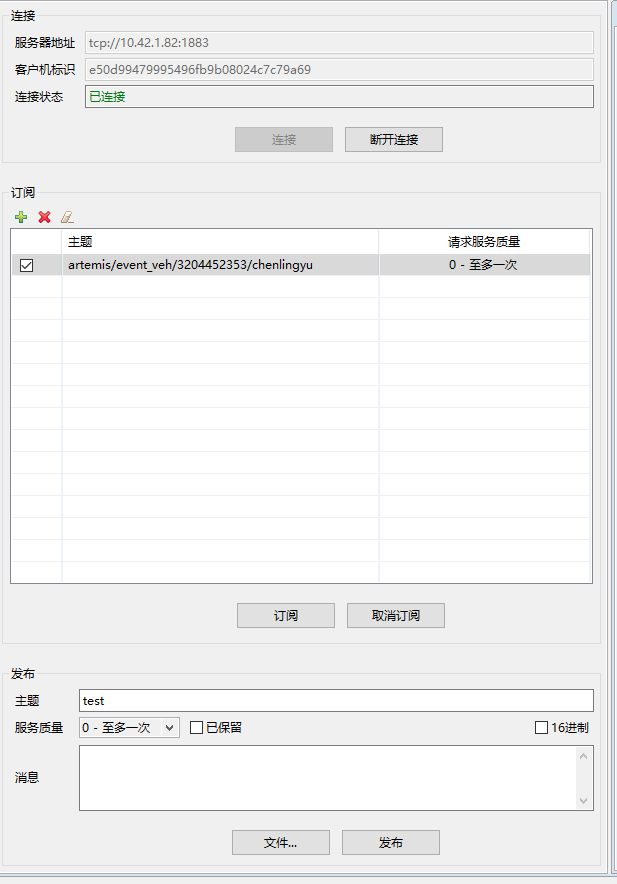
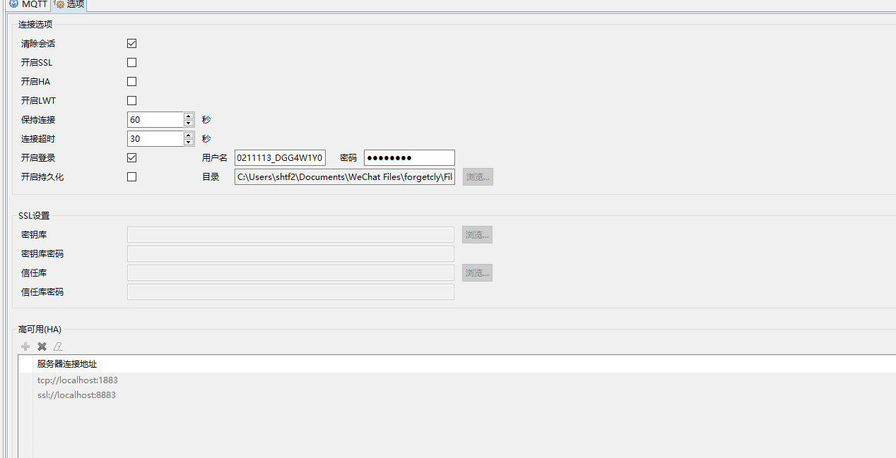
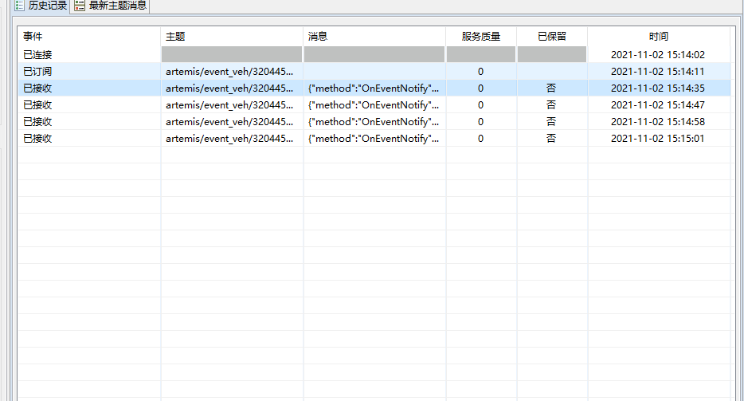

#### !!!!!请配合img文件夹食用截图
# 实现步骤
1. 部署Infovision Iot(SIP)
   
   `在H公司的提供服务器内部署Infovision Iot v1.6.2`

2. 部署人员添加车辆卡口摄像头(CID1\CID2\CID3)

3. 部署人员提供合作方信息(UserID/AppKey/Appsecret)

4. 根据H公司业务开发应用
   - 后端
     - 实现OpenApi认证
       - 自己开发签名部分/或者使用OpenApi鉴权库实现接口调用
        
     - 通过对接OpenApi实现对应功能
       1. 跟OpenApi各个接口的桥接(通过鉴权桥接)
   - 其他
     - 实现订阅/在订阅端电脑中添加MQTT插件(需求JDK1.8环境)
5. 功能实现原理
      
      - 通过海康[区域接口](https://open.hikvision.com/docs/docId?productId=5c67f20bb254d61550c2f63e&curNodeId=294dc9cc55cf419ca807774c1fd200870)根据客户需求获取卡口列表(根据需求列举筛选条件和选定查询接口)得到卡口idList字符串`crossingIndexCodes`(KID1,KID2,KID3,...)
        - /api/resource/v1/crossing/getCrossingsWithPage
        - /api/resource/v1/crossing/getCrossingsBySpatialIndexWithPage
        - /api/resource/v1/crossing/getCrossingsByUnitIndexCodeWithPage
        
     
      - 通过海康[车辆应用接口](https://open.hikvision.com/docs/docId?productId=5c67f20bb254d61550c2f63e&curNodeId=3529d6d14b1744ae8dc56097fd8d21c7#afbb27a7)的`车辆布控`接口/api/aiapplication/v1/vehicle/addVehicleControl,添加布控
      ```
         {
            "taskName": "cly-实操测试布控信息",
            "beginTime": "2021-06-15T00:00:00.000+08:00",
            "endTime": "2021-06-15T23:00:00.000+08:00",
            "plateNo": "粤*", //根据需求模糊查询支持*查询
            "plateColor": "blue",
            "crossingIndexCodes": "${crossingIndexCodes}",//上一步的卡口IDS
            "reason": "2",
            "remark": "XXX",
            "phoneNos": "157********",
            "content": "XXXXX",
            "vehicleType": "vehicle",
            "vehicleColor": "red",
            "vehicleLogo": "1028"
         }
      ```
      
      
      - 通过海康[事件订阅接口](https://open.hikvision.com/docs/docId?productId=5c67f20bb254d61550c2f63e&curNodeId=3529d6d14b1744ae8dc56097fd8d21c7#afbb27a7)的`按事件类型获取事件订阅信息`接口/api/common/v1/event/getMultiTopicInfo查询订阅布控信息类型ID为`3204452353`
      
      
      
      - 再MQTT桌面插件中添加上述结果中的参数
        - 服务器地址
        - 客户机标识
        - topicname
        - 登录账户名\密码
        - 
      
      

      - 在MQTT插件中接受订阅的事件/或者在继承RabbitMQ中接受消息
      