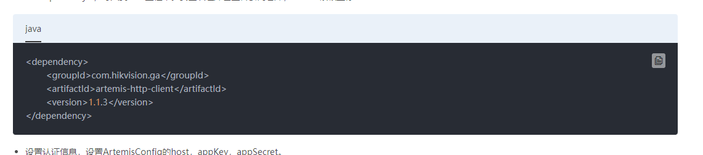
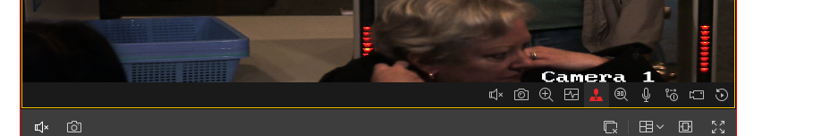

#### !!!!!请配合img文件夹食用截图
# 实现步骤
1. 部署Infovision Iot(SIP)
   
   `在H公司的提供服务器内部署Infovision Iot v1.6.2`

2. 部署人员添加区域摄像头(CID1\CID2\CID3)

3. 部署人员提供合作方信息(UserID/AppKey/Appsecret)

4. 根据H公司业务开发应用
   - 后端
     - 实现OpenApi认证
       - 自己开发签名部分/或者使用OpenApi鉴权库实现接口调用
        
     - 通过对接OpenApi实现对应功能
       1. 跟OpenApi各个接口的桥接(通过鉴权桥接)
   - 前端
     1. 根据`海康视频web插件`的demo实现一个前端播放器
     2. 客户端(监控中心电脑)安装`VideoWebPlugin` 

5. 功能实现原理
   1. 基础信息获取
      - 通过海康[区域接口](https://open.hikvision.com/docs/docId?productId=5c67f20bb254d61550c2f63e&curNodeId=3058b5fd7b704161bbc9869db8daa010)根据客户需求获取区域信息
         - /api/resource/v1/unit/getAllTreeCode
         - /api/resource/v1/regions
      - 通过获取到的区域编号或者树编号根据海康[设备接口](https://open.hikvision.com/docs/docId?productId=5c67f20bb254d61550c2f63e&curNodeId=65c3316031694857be523d92cc4a0117)获取设备列表
         - /api/resource/v1/device/getDeviceWithPage
         - /api/api/resource/v1/device/getDeviceByUnitIndexCodeWithPage
         - /api/resource/v1/device/getDeviceByIndexCode
      - 通过海康[预览取流](https://open.hikvision.com/docs/docId?productId=5c67f20bb254d61550c2f63e&curNodeId=c7043d2054f44186a0b5915d8242f5d0)接口根据需求流协议(RTMP/RTSP/HLS/FLV)等获取流
   2. 点位设备预览
      - 在web插件初始化，写入参数
        - AppKey
        - Appsecret
        - SIP:PORT
        - ..等其他调参
      - 播放器参数中写入
        - "cameraIndexCode":CID1
      - 获取推流
   3. 点位设备回放
      - 初始化参数`playMode`设置为1
      - 点击前端播放器回放按钮
      - 前端播放器回访操作
   4. 点位设备异常抓图
      - 全段获取流异常中抓取cameraIndexCode,调取WebControl的JSRequest渠道通过请求抓图抓取一张异常图片然后根据逻辑path+cameraIndexCode的形式存入已备查询并邮件通知客户(返回的picData参数中有图片base64字符串)
      ```
      {
        "argument": {
           "name": "${path}${cameraIndexCode}.jpg",
            "wndId": 1
            },
         "funcName": "snapShot"
       }
                
      ```
   5. 云台控制
      - 点击前端播放器云台按钮
      - 前端播放器云台操作
   6. 叠加信息
       - 根据需求所需添加字符`ADDSTR`和坐标[x,y]以及字体信息等添加叠加信息
      ```
      {
         "argument": {
               "alignType": 1,
                "bold": 0,
               "color": 255,
                "fontSize": 12,
                "text": "${ADDSTR}",
              "wndId": 0,
              "x": 0,
               "y": 0
        },
         "funcName": "drawOSD"
        }             
      ``` 
   7. 轮询播放(100个监控点 4个监控点循环
      - 以适当方式获取到监控点ID
      - 播放器初始化时设置`layout`为4*4
      - 多个监控点在前端以Interval的方式循环通过JSRequest获取流地址
      - 通过访问4个不同窗口然后重写`cameraIndexCode`的方式重构新的流媒体
      - 停止上一轮的4个推流(停掉前端Interval 就好了，推流地址5分钟失效？)
